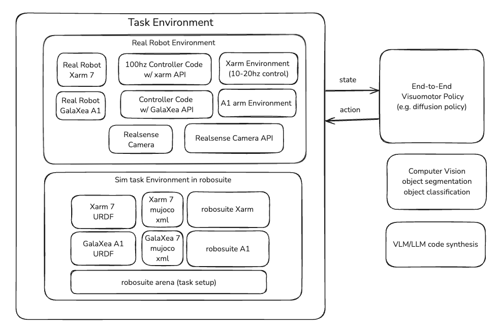

# ril-env
**ril-env** is an environment management package designed for robotic control, perception and simulation. It provides an API and programmatic interface to manage state-action flow for both real hardware robots and sensors and their simulation counterparts.

Currently, **ril-env** supports record-replay of the xArm 7 robotic arm on a single machine, with the option of camera perception running in a seperate thread.

More features will be added soon; see the issues tab under the repository.



## Having trouble connecting?
Run the following
```
sudo ip addr add 192.168.1.100/24 dev enp2s0
sudo ip link set enp2s0 up
sudo ip route add 192.168.1.223 dev enp2s0
```

## Installation
**ril-env** is tested on Ubuntu Linux with Python 3.

To get started, first clone the repository.
```
git clone https://github.com/UCLA-Robot-Intelligence-Lab/ril-env.git
```
This repository uses the `xarm` folder from the [xArm-Python-Sdk](https://github.com/xArm-Developer/xArm-Python-SDK)
package. If there are any issues, it is recommended that you do the
following:

First remove the `xarm` folder. Using the
[xArm-Python-Sdk](https://github.com/xArm-Developer/xArm-Python-SDK)
package, follow the instructions on that repo and install the package
at the root of this repository. Then after installing, move the `xarm` folder into the
root repository and remove `xArm-Python-Sdk`.

Create the conda (recommended) environment. Replace `rilenv` your preferred name for the environment. Run this at the root of your repository:
```
conda env create -n rilenv -f environment.yml
```
Finally, set up the package:
```
pip install -e .
```
## Basic Usage

Ensure that the arm is enabled on the machine you will run the relevant script on.

To run both the perception and xArm 7 robotic arm, you can use the `joint_script.py` script. 
To run perception and the robotic arm seperately, you can either run `xarm_script.py` and `camera_script.py` seperately.

You can access nearly all of the parameters for the APIs through their respective config dataclasses. Then, when writing or using a script, you simply need to specify what parameters to change and what to change them to when the `config()` object is being created. 
